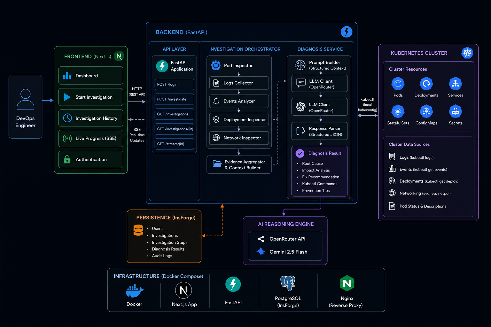

<div align="center">
  
# 🤖 AI Kubernetes Troubleshooting Agent


*Your AI-powered assistant for debugging and diagnosing Kubernetes clusters in real-time.*

[](LICENSE)

</div>

---

## 🌟 Overview

The **AI Kubernetes Troubleshooting Agent** is an intelligent orchestration tool designed to streamline DevOps workflows. Instead of manually running dozens of `kubectl` commands to diagnose a failing cluster, this tool fetches the state of your Pods, Deployments, Services, and Events, and feeds them into an advanced Large Language Model (LLM). The LLM processes the data and provides a **Root Cause Analysis**, **Fix Recommendations**, and the exact **Kubectl Commands** needed to resolve the issue!

## ✨ Key Features

- 🧠 **AI-Powered Diagnosis** — Powered by OpenRouter (Gemini 2.5 Flash), providing actionable root-cause analysis.
- ⚡ **Real-time Streaming** — Uses Server-Sent Events (SSE) to stream live investigation progress to the dashboard.
- 🔒 **Secure BaaS Integration** — Uses **InsForge** for user authentication and persistent investigation history.
- 🌐 **Multi-Cluster Support** — Investigate any cluster context from your kubeconfig (local Kind, EKS, GKE, etc.).
- 🐳 **Fully Dockerized** — One `docker-compose up` to run the entire stack.
- 🛡️ **Graceful Error Handling** — Handles invalid kubeconfigs, transient network issues, and LLM parsing errors without crashing.

---

## 🏗️ Architecture



| Layer | Technology | Responsibility |
|-------|-----------|---------------|
| 🎨 **Frontend** | Next.js + Tailwind CSS | Authentication UI, investigation dashboard, SSE consumer |
| ⚙️ **Backend** | FastAPI (Python) | Orchestrates `kubectl` subprocess calls, streams SSE events |
| 🧠 **AI Engine** | OpenRouter (Gemini 2.5 Flash) | Receives structured K8s data, returns JSON diagnosis |
| 🗄️ **Database** | InsForge (PostgreSQL + PostgREST) | User sessions, investigation history with RLS |

---

## 📁 Project Structure

```
ai-k8s-agent/
├── backend/                    # 🐍 FastAPI backend
│   ├── app/
│   │   ├── ai/                 # LLM client, prompt builder, root cause analyzer
│   │   ├── api/                # Auth dependency injection (deps.py)
│   │   ├── core/               # Config & logging setup
│   │   ├── kubernetes/         # kubectl inspectors (pods, logs, events, deployments, network)
│   │   ├── services/           # Investigation orchestration, diagnosis, InsForge persistence
│   │   └── main.py             # FastAPI app with SSE /investigate endpoint
│   ├── schema.sql              # Database schema for InsForge
│   ├── requirements.txt        # Python dependencies
│   ├── Dockerfile
│   └── .env.example            # Template for environment variables
├── frontend/                   # ⚛️ Next.js frontend
│   ├── src/
│   │   ├── app/                # Pages: login, dashboard
│   │   ├── components/         # DiagnosisCard and UI components
│   │   ├── hooks/              # useInvestigation custom hook
│   │   ├── services/           # Axios API client
│   │   └── lib/                # InsForge SDK client
│   ├── Dockerfile
│   └── package.json
├── test_scenarios/             # 🧪 YAML files for simulating cluster failures
│   ├── crashing_pod.yaml
│   └── network_mismatch.yaml
├── docs/                       # 📖 Architecture diagram & API docs
├── docker-compose.yml          # 🐳 One-command stack setup
└── README.md
```

---

## 🚀 Getting Started

### Prerequisites

Ensure you have the following installed on your machine:

| Tool | Purpose |
|------|---------|
| 🐳 [Docker](https://www.docker.com/) & Docker Compose | Container runtime |
| ⎈ [Kubectl](https://kubernetes.io/docs/tasks/tools/) | Kubernetes CLI |
| 📦 [Node.js](https://nodejs.org/) v18+ | Frontend development |
| ☸️ [Kind](https://kind.sigs.k8s.io/) or [Minikube](https://minikube.sigs.k8s.io/docs/start/) | Local Kubernetes cluster |

### 1️⃣ Clone the Repository

```bash
git clone https://github.com/amco-f22/ai-k8s-agent.git
cd ai-k8s-agent
```

### 2️⃣ Configure Environment Variables

Copy the example environment file and fill in your keys:

```bash
cp backend/.env.example backend/.env
```

Then edit `backend/.env` with your actual values:

```env
OPENROUTER_API_KEY=sk-or-v1-xxxxxxxxxxxx   # Get from https://openrouter.ai/keys
OPENROUTER_MODEL=google/gemini-2.5-flash   # Or any OpenRouter-supported model
KUBECONFIG_PATH=~/.kube/config
INSFORGE_URL=https://your-app.region.insforge.app
INSFORGE_ANON_KEY=ik_xxxxxxxxxxxxxxxx
```

### 3️⃣ Set Up the Database

Run the SQL schema against your InsForge database to create the `investigations` table with Row Level Security:

```bash
# Using InsForge CLI
npx -y @insforge/cli@latest db query "$(cat backend/schema.sql)"
```

### 4️⃣ Start the Backend

The backend mounts your local `~/.kube/config` so it can run `kubectl` against your clusters:

```bash
docker-compose up -d
```

> ✅ Backend API: `http://localhost:8000` &nbsp;|&nbsp; Health check: `http://localhost:8000/health`

### 5️⃣ Start the Frontend (Development)

```bash
cd frontend
npm install
npm run dev
```

> ✅ Frontend Dashboard: `http://localhost:3000`

---

## 🔌 API Endpoints

| Method | Endpoint | Auth | Description |
|--------|----------|------|-------------|
| `GET` | `/health` | ❌ | Health check |
| `GET` | `/clusters` | ✅ | List available kubeconfig cluster contexts |
| `POST` | `/investigate` | ✅ | Run AI investigation (returns SSE stream) |
| `GET` | `/investigations` | ✅ | Fetch user's investigation history |
| `DELETE` | `/investigations/{id}` | ✅ | Delete a specific investigation |

---

## 🧪 Testing Scenarios

We've included YAML files that deploy intentionally broken resources to your cluster so you can see the AI in action:

| Scenario | File | What It Breaks |
|----------|------|---------------|
| 🔴 CrashLoopBackOff | `test_scenarios/crashing_pod.yaml` | Deploys a pod with an invalid command |
| 🟡 Service Mismatch | `test_scenarios/network_mismatch.yaml` | Creates a Service with a selector that matches no pods |

**Apply a scenario:**
```bash
kubectl apply -f test_scenarios/crashing_pod.yaml
```

**Run an investigation** from the Dashboard and watch the AI pinpoint the exact problem! 🎯

**Clean up after testing:**
```bash
kubectl delete -f test_scenarios/crashing_pod.yaml
```

---

## 🧗 Challenges Faced

During the development of this project, we encountered and overcame several complex challenges:

### 1. LLM Hallucinations & Formatting 🧩
- **Challenge:** The LLM would occasionally return raw markdown (` ```json `) instead of valid JSON, breaking the backend parser.
- **Solution:** Implemented strict prompt engineering with few-shot examples and a fallback parser to catch `json.decoder.JSONDecodeError` gracefully, stripping markdown fences before re-parsing.

### 2. Schema Caching with InsForge (PostgREST) 🗄️
- **Challenge:** After altering the `investigations` table to add a `cluster_name` column, the backend returned `400 Bad Request` because PostgREST was serving a stale schema cache.
- **Solution:** Executed `NOTIFY pgrst, 'reload schema'` directly via the CLI to instantly refresh the cache without a hard database reboot.

### 3. Real-time Streaming Over HTTP 🌊
- **Challenge:** Providing natural, step-by-step progress to the user while waiting for a ~15-second LLM API response, without the browser timing out.
- **Solution:** Implemented **Server-Sent Events (SSE)** using Python `yield` generators in FastAPI. The frontend consumes these as a stream, rendering each step (Pods → Logs → Events → Deployments → Network → Diagnosis) in real-time.

### 4. Dockerizing Kubeconfig Access 🐳
- **Challenge:** Allowing a containerized FastAPI backend to securely execute `kubectl` against the host machine's Kubernetes clusters.
- **Solution:** Mounted `~/.kube` as a read-only volume in `docker-compose.yml`, giving the container seamless access to all cluster contexts.

### 5. Stale Events Causing False Positives 👻
- **Challenge:** On a perfectly healthy cluster, the AI would report "Node failure and control plane instability" as a critical issue. This happened because Kubernetes retains old Warning events (like `Rebooted`, `Unhealthy`, `BackOff`) from previous Docker Desktop restarts — even though the cluster had fully recovered.
- **Solution:** Applied a two-pronged fix:
  1. **Time-based event filtering** in `events_analyzer.py` — only events from the last 5 minutes are now included in the investigation data, filtering out stale noise.
  2. **Improved LLM prompt** in `prompt_builder.py` — explicitly instructs the AI to determine cluster health by the *current* state of pods (Running vs CrashLoopBackOff), not by historical events. A healthy cluster now correctly returns `severity: "info"`.

---

## 🏆 Best Practices Followed

| Practice | How We Applied It |
|----------|-------------------|
| 🧩 **Modularity** | K8s inspection logic is fully decoupled into separate files: `pod_inspector.py`, `network_inspector.py`, `events_analyzer.py`, etc. |
| 🔐 **Subprocess over SDK** | We use `kubectl` via subprocess instead of the Python `kubernetes` library, enforcing strict RBAC and context isolation. |
| 🚪 **Auth-first design** | Every API request is validated against InsForge sessions; 401s on the frontend trigger automatic logout. |
| 🔄 **Retry with backoff** | The LLM client retries transient errors (429, 500, 502, 503) with exponential backoff (1s → 2s → 4s). |
| 🗃️ **Row Level Security** | The `investigations` table uses PostgreSQL RLS so users can only read their own data. |
| 📝 **Structured logging** | Uses Loguru for rich, structured log output with timestamps and severity levels. |
| ⏱️ **Event recency filtering** | Only Kubernetes events from the last 5 minutes are fed to the AI, eliminating false positives from stale cluster history. |

---

## 📚 Additional Documentation

Dive deeper into specific components:

- 📖 **[API & Architecture Docs](docs/README.md)** — Backend architecture, full API endpoint table, and additional test scenarios.
- 🎨 **[Frontend Documentation](frontend/README.md)** — Next.js development, build, and deployment guide.
- 🗄️ **[Database Schema](backend/schema.sql)** — PostgreSQL table definitions with RLS policies.

---

## 🤝 Contributing

Contributions, issues, and feature requests are welcome! Feel free to check the [issues page](https://github.com/amco-f22/ai-k8s-agent/issues).

1. Fork the repository
2. Create your feature branch (`git checkout -b feature/amazing-feature`)
3. Commit your changes (`git commit -m 'feat: Add amazing feature'`)
4. Push to the branch (`git push origin feature/amazing-feature`)
5. Open a Pull Request

## 📝 License

This project is licensed under the MIT License — see the [LICENSE](LICENSE) file for details.

---

<div align="center">

*Built with ❤️ for DevOps Engineers everywhere.*

</div>
